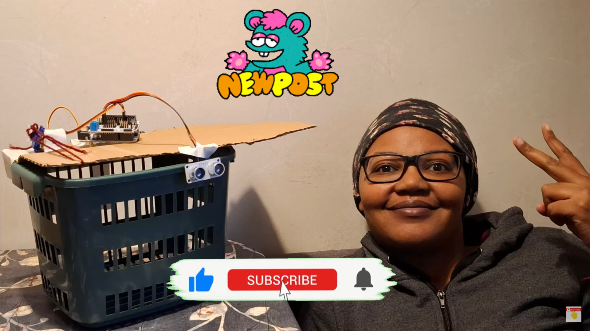
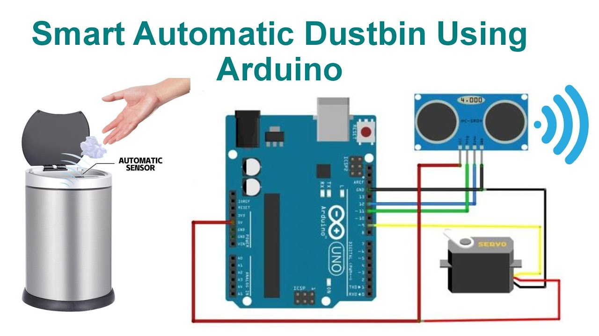
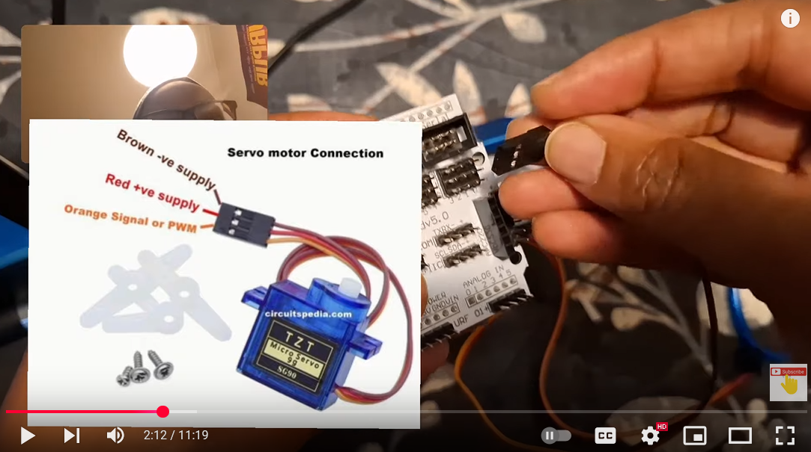

# Smart-Dustbin-Project1
Dont Open Waste Bins with Hand use lets learn How to Make Smart Dustbin Using Arduino, Ultrasonic Sensor & ChatGPT Tutorial #arduino  | Project1 that opens its lid automatically when it detects an object (such as a hand or trash) within a specified range(we set 20 cm). Smart dustbin helps you maintain hygiene, avoid static shocks etc. This projects works by: The ultrasonic sensor  detects the object’s distance, and the servo motor operates the lid waits 3 seconds the closes the lid. 


## Step 1: Gather all the Necessary Components
A. Arduino Uno
B. Sensor shield (optional)
C. Ultrasonic Sensor (HC-SR04) - (An ultrasonic sensor measures the distance of an object by emitting ultrasonic sound waves. The reflected waves from the object are received by the sensor and are converted to corresponding electrical signals.)
D. Jumpers wires
E. SG90 Micro-servo motor
F. Arduino IDE (download IDE from www.arduino.cc/en/)
G. Dustbin
H. Computer
I. Scissors
K. Thread
L. Cartoon

## Step 2: Connect the Components (use wiring diagrams)



## Step 3: Write Your Code (using ChatGPT:https://chatgpt.com/)
``` C++

#include <Servo.h>

#define trigPin A1   // Ultrasonic Sensor Trigger Pin
#define echoPin A0   // Ultrasonic Sensor Echo Pin
#define servoPin 4   // Servo Motor Signal Pin

Servo myServo;  // Create Servo object
long duration;  // Variable to store pulse duration
int distance;   // Variable to store distance in cm

void setup() {
  pinMode(trigPin, OUTPUT); // Set trigPin as OUTPUT
  pinMode(echoPin, INPUT);  // Set echoPin as INPUT
  myServo.attach(servoPin); // Attach Servo to pin 9
  myServo.write(0);         // Keep the dustbin closed initially
  Serial.begin(9600);       // Start serial communication
}

void loop() {
  // Send a pulse to the ultrasonic sensor
  digitalWrite(trigPin, LOW);
  delayMicroseconds(2);
  digitalWrite(trigPin, HIGH);
  delayMicroseconds(10);
  digitalWrite(trigPin, LOW);

  // Read the time taken for the pulse to return
  duration = pulseIn(echoPin, HIGH);

  // Calculate distance in centimeters
  distance = duration * 0.0344 / 2;

  // Print distance to Serial Monitor
  Serial.print("Distance: ");
  Serial.print(distance);
  Serial.println(" cm");

  // If distance is less than 20 cm, open the dustbin lid
  if (distance < 20) {
    myServo.write(180);  // Rotate servo to 180° (Open Lid)
    delay(3000);        // Keep lid open for 3 seconds
    myServo.write(0);   // Close Lid (0°)
  }

  delay(100); // Small delay before the next measurement
}
```
## Step 4: Upload and Run 
Watch step by step tutorial here [](https://youtu.be/OhQOu41KUYQ)

